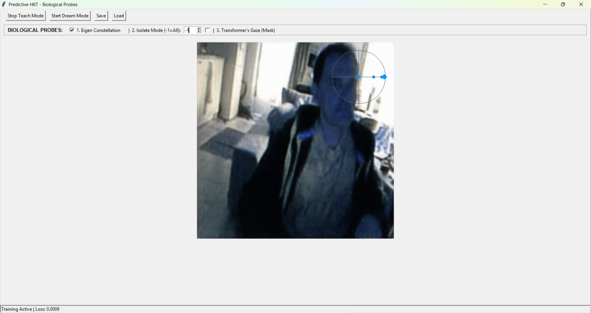

# Predictive HKT

EDIT: Added the chandelier neuron inspired version by claude opus. Also it wrote a 'paper' about it. 
Make that two chandelier inspired versions and yet another paper. 

## A live, trainless Koopman dynamics-tomograph with a biological gating front end — the geometric neuron's three organs running together on a real video stream



**PerceptionLab / Antti Luode, with Claude (Opus 4.8), and dialogue with Grok. Helsinki, June 2026.**

> Do not hype. Do not lie. Just show.

---

## The one idea

HKT — **H**olographic **K**oopman–**T**akens — is the geometric-neuron picture made into one running object, pointed at a webcam. A dendrite is a Takens delay line; the AIS reads the field's geometry as a Koopman operator; a basket cell gates what is allowed through. This program wires those three organs together and lets them watch the world in real time:

> A small CNN compresses each frame and a **basket-cell gate** whitens it. A long window of compressed frames (default 80) forms a **Takens delay buffer**. Every single frame, a fresh least-squares fit produces a **Koopman operator `A`** that maps the present state to the next — and its eigenvalues, plotted on the complex unit disk, are a *live, label-free factoring of the scene into what is still, what is turning, and what is dying out.* A transformer reads that spectrum and paints an attention mask; a decoder reconstructs the predicted next frame.

The learned parts (the CNNs, the gate, the transformer mask) are ordinary gradient descent. The temporal core — the operator `A` and its eigen-constellation — is **fit on the fly, trainless, every frame.** That core is the interesting part, and it is the part this repo exists to show.

---

## What you are looking at

The window reconstructs the predicted *next* frame, and three **Biological Probes** (the toggles across the top) draw the machinery directly onto the video:

- **1. Eigen Constellation** — the top-`k` eigenvalues of `A` on the complex plane, as a small radar overlay in the corner. **Right edge** (angle ≈ 0, radius ≈ 1): zero-frequency, infinitely persistent modes — the static world (the wall, the furniture, your resting mass). **Left edge** (angle ≈ π): the Nyquist zone — the fastest oscillation the frame rate can carry. Wave your hand rhythmically and watch dots break the right-hand cluster and sprint left: the model has sliced your room into a static hemisphere and a kinetic one, with no labels and no training. The currently isolated mode is drawn green.
- **2. Isolate Mode** (`-1` = all) — zero every eigenvalue except the chosen one before the readout, so you see what a *single* island of the dynamics contributes to the reconstruction and the mask.
- **3. Transformer's Gaze (Mask)** — the attention mask the transformer paints over the spatial latent from reading the spectrum alone, blended over the frame as a JET heatmap.

**Teach Mode** learns the next-frame transition `T → T+1`, distilled against a Stable-Video-Diffusion VAE as the teacher. **Dream Mode** freezes the input, cuts the webcam, and advances pure `Aᴷ` with a 1% friction term — the system free-runs its own physics forward and you watch the constellation slowly **amble to the center**: the dream losing momentum to friction and dying of old age, a heat-death with no sensory drive to re-energize it.

---

## Architecture

```
frame (512×512)
   │
   ▼  Stage 1 — Spatial encode + Basket-Cell Gate
 CNN 512→64, 4ch  →  Conv+Sigmoid gate (perisomatic common-mode whitening)  →  256-d latent
   │
   ▼  Stage 2 — Takens embedding + live Koopman fit   [TRAINLESS, per frame]
 delay buffer of compressed latents (default 80 frames)
 A = X2 · X1⁺            (least-squares one-step operator; ridge-regularized)
 eig(A); |λ| clamped ≤ 1 (homeostatic); top-k by magnitude
 dynamic_latent = [ magnitude(k) , phase(k) ]      (k=16 → 32 numbers)
 dream: A ← A·A  each step, ×0.99 friction          (Aᴷ = K-step prediction)
   │
   ▼  Stage 3 — Transformer read + mask + decode
 transformer over the spectrum  →  attention mask  →  ConvTranspose decoder  →  predicted next frame
```

| stage | role | learned? |
|---|---|---|
| CNN encoder / decoder | perceptual compression and reconstruction | yes (Adam, MSE vs teacher) |
| basket-cell gate | perisomatic common-mode inhibition / spatial whitening | yes |
| Takens delay buffer | the dendritic delay line — holds the recent orbit (default 80) | no (a buffer) |
| Koopman operator `A` | the one-step dynamics; eigenvalues = the islands | **no — fit per frame** |
| transformer mask | the gamma / attention readout, gates what is expressed | yes |
| teacher VAE | training target (SVD temporal VAE), never shipped in the model | frozen, pretrained |

---

## Quickstart

```bash
pip install torch torchvision diffusers opencv-python pillow numpy
python predictive-hkt3.py
```

A CUDA GPU is strongly recommended. On first run `diffusers` pulls the teacher VAE
(`stabilityai/stable-video-diffusion-img2vid-xt`, the `vae` subfolder) from Hugging Face —
you may need to accept its license and `huggingface-cli login`. The teacher is used **only**
as the training target; the saved `.pth` contains just the small HKT encoder and decoder.

Then: press **Start Teach Mode**, sit in front of the camera, and watch the loss fall and the
reconstruction sharpen. Give it **~80 frames (a few seconds) to warm up** — the delay buffer
must fill before the Koopman stage and the constellation come alive. Then tick **1. Eigen
Constellation** and wave your hand to see the modes migrate; set **2. Isolate Mode** to watch
one island at a time; tick **3. Transformer's Gaze** to see the mask. Press **Start Dream Mode**
to cut reality and watch the physics engine free-run and decay.

---

## The honest ledger

**Verified (it runs and does what is claimed):**
- it learns: next-frame prediction loss falls and the masked reconstruction sharpens during teach mode;
- the live Koopman fit produces an eigen-constellation that factors the stream — static modes cluster on the right ring, rhythmic motion spawns modes on the left (the hand-waving experiment), all trainless and per-frame;
- with the default long delay (80), high-frequency camera jitter is crushed into the static background and the dominant modes sit cleanly on the right until something genuinely moves;
- dream mode free-runs `Aᴷ` and decays to the center under the 0.99 friction — the dream runs out of gas rather than exploding.

**Clean structural mappings (sound as rhymes, labelled as such — not claims about tissue):**
- Takens delay buffer = the dendritic delay line (cable theory; `the_geometric_neuron_grounded.md`);
- the basket-cell gate = perisomatic PV⁺ common-mode inhibition / whitening — strip the shared drive and the structure shows;
- the Koopman eigenvalues (magnitude = persistence, phase = rotation rate ω) = the spectral islands, live: this is the IslandNet complex plane ρ = decay + iω on a webcam (`THESIS.md`);
- the transformer mask = the gamma / attention readout that gates expression;
- the |λ| ≤ 1 clamp + the 0.99 friction = the metabolic / homeostatic energy limit; dream-mode heat-death = the arrow of time fading once sensory drive is cut.

**Honest limits (read these before believing the demo):**
- **as a generative video model it is middling.** It distills the teacher VAE and will not beat it; the output is a gated, denoised autoencode, not new generative capability. Do not sell it there.
- **the operator is still a regularized estimate.** With `delay=80`, `A` (256×256) is fit from ~80 transition pairs — better-conditioned than a short window and enough to pin the dominant ~16 modes, but still underdetermined (80 < 256) and ridge-regularized, so the constellation is a *qualitative* dynamics readout, not calibrated modal analysis. Lower the delay for faster temporal response at the cost of cleanliness.
- **in teach mode the encoder is still training**, so `A` is fit in a *moving* latent space — modes drift partly because the *learner* drifts, not only because the world does. To use the constellation as a measurement instrument rather than a visualization, freeze the encoder after warm-up (the read/write seam: freeze the write, let the read measure).
- the "physics" is real for the DMD core and decoration for the learned shell — keep them in separate drawers;
- everything is in relative units, calibrated to nothing physical.

**The bet (untouched):** that any of this is *experienced* rather than processed. HKT runs the three organs together on real input and shows a substrate that perceives, predicts, and reads its own dynamics. It does not touch the hard problem.

---

## Where it goes next

The value here is not the video reconstruction — it is the **instrument**: a live, trainless, interpretable readout of any stream's dynamics. The motivated next builds:

1. **Freeze the front end → make it a measurement.** Adaptation stops after warm-up; the loop logs each top mode's `(ω, |λ|)` and flags a mode that crosses a threshold. The constellation becomes a monitor, not a picture.
2. **Point it at something that isn't a face.** A spinning fan, a vibrating beam, a motor — its modal eigenvalues are its health signature, and a mode drifting in frequency or damping is a fault appearing *before* it breaks. Trainless, self-calibrating, interpretable, cheap: exactly where black-box video models are weakest.
3. **Run the same engine on EEG / MEG.** This is the video instance of the machinery behind the trainless geometric-dysrhythmia EEG result. On physiology, the constellation's collapse is the dysrhythmia, live.
4. **Use the 32-number `dynamic_latent` as a gesture descriptor** — recognizing *orbits* (motion) rather than *poses* (snapshots), on the dynamics side.

---

## Lineage

Built on the Geometric Neuron line and the Mycelial Cortex (PerceptionLab): the dendrite as a Takens delay line and the AIS as a Koopman read (`the_geometric_neuron_grounded.md`); the islands as the spectrum of a lag operator, ρ = decay + iω (`THESIS.md`); the delay-embedded-islands synthesis (`membrane_to_qualia_synthesis.md`); and the basket-cell-as-timing-gate insight worked out in dialogue with Grok (`brain_inspired_model.txt`). The original framework and direction are Antti Luode's; this engine, its probes, and this document were developed collaboratively with Claude (Opus 4.8). MIT.

*The dendrite remembers, the basket cell gates, and the Koopman operator reads — and the constellation tells the truth: a room at peace sits on the right, a moving hand flies to the left, and a dream with no eyes drifts to the center and fades. Do not hype. Do not lie. Just show.*
